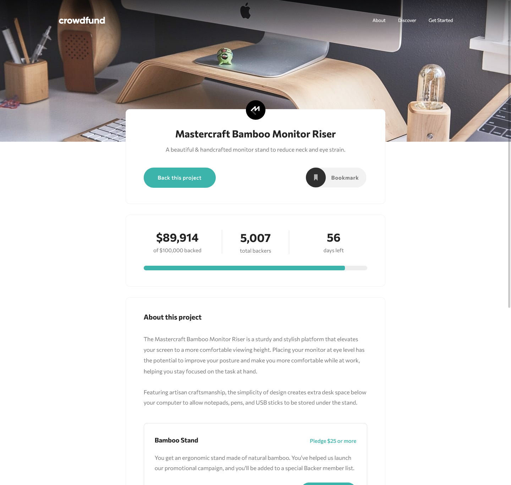
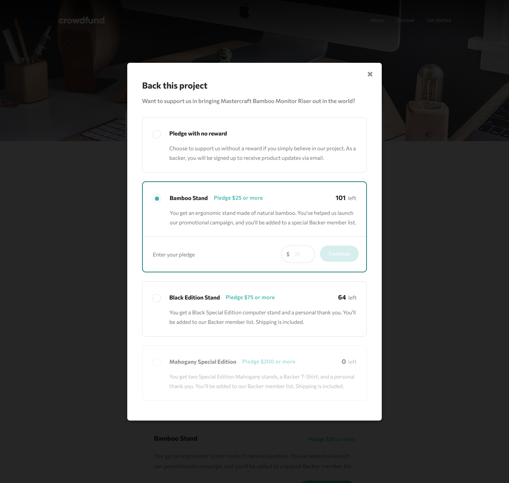

# Mastercraft Crowdfunding

This is a solution to the [Crowdfunding product page challenge on Frontend Mentor](https://www.frontendmentor.io/challenges/crowdfunding-product-page-7uvcZe7ZR).

## Table of contents

- [Overview](#overview)

  - [The challenge](#the-challenge)
  - [Screenshot](#screenshot)
  - [Links](#links)
  - [Built with](#built-with)

## Overview

### The challenge

Users should be able to:

- View the optimal layout depending on their device's screen size.
- See hover states for interactive elements.
- Make a selection of which pledge to make.
- See an updated progress bar and total money raised based on their pledge total after confirming a pledge.
- See the number of total backers increment by one after confirming a pledge.
- Toggle whether or not the product is bookmarked.

### Screenshots

### Links

- Solution URL: [Frontend Mentor Solution](https://www.frontendmentor.io/solutions/mastercraft-crowdfunding-using-react-sass-and-semantic-ui-EwksLQsbS)
- Live Site URL: [Crowdfunding Page](https://mastercraft-crowdfunding.vercel.app/)

### Built with

- Semantic HTML5 markup
- Flexbox
- CSS Grid
- [Sass](https://sass-lang.com/) - for styling
- [React](https://reactjs.org/) - JS library
- [Semantic UI React](https://react.semantic-ui.com/) - for some ready-to-use components
